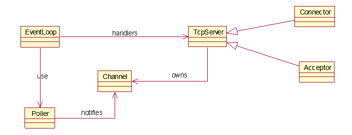

# CeleryStalk

## 项目介绍

本项目是一个仿照muduo高性能网络库编写的一个简单网络库，其中实现了Reactor模式，Buffer缓存，多线程server，多缓冲区异步日志系统等模块，并对socket编程的各个部分进行封装。通过EventLoop对连接进行监听管理，主EventLoop线程负责accept请求监听，并通过轮询的方式分配给其他EventLoop线程。当EventLoop上发生某事件时，会调用对应事件的回调函数对事件进行处理。

### Reactor



为了简单的理解上面的Reactor模式，我们假设下面一个场景：

```
医院每个护士都分配管理几个床位，每个病人都能够按护士铃叫护士。

当病人按护士铃时，护士站中对应的护士过来常看，病人提出相应的要求，护士根据病人的要求做zhan出相应的处理。

这里护士铃就是上面对应的Poller,护士就是上面对应的channel, 护士站就是上面对应的TCPServer。护士做出相应的处理对应了这里的handlers。
```

Reactor事件驱动的，我们首先要在EventLoop注册我们要监听的事件，这里实际监听的对象是Poller，它调用一些I/O多路复用的系统调用。在注册监听事件的同时，也要注册监听事件发生的回调函数。这里的回调函数是多层次的，就类似于俄罗斯套娃。当触发了某事件时，先调用最外层的俄罗斯套娃，把它调用完，再调用内层的俄罗斯套娃，知道所有的套娃都取下。通过这种分层的链接式的调用操作，我们可以设置用户函数，把它链接在回调函数的最里层。换句话说，通过这种操作，方便了用户的多样化的功能实现，达到了网络库的复用的目的。

###  Buffer缓存

当触发读事件时，需要从系统缓冲区中取出数据放到用户缓冲区中，然后由用户对读到的数据做进一步处理。每个连接需要各自的发送发送缓冲区和接受缓冲区。

每个缓冲区实际上相当于一个queue，当如果直接使用STL的queue，服务器的效率会打折扣。故而使用预分配指定大小的string来作为缓冲区。为实现queue的功能，采用如下逻辑：

1. _begin指向string中的队尾，_end指向string中的队头
2. 当将数据读入到string中，直接添加到string的末尾，如果空间不够，分配新的空间
3. 当把数据从string读出，如果当前的读出的位置大于1024，则回收之前的空间，改变begin和end的值。

### 多缓冲区异步日志系统

日志库采用的

## 为什么采用one_loop_per_thread i/o模型

## 为什么优先采用Epoll

## 如何安全的对对象生命周期进行管理


## 与muduo相比的一些不足


## 项目中遇到的难题

1. 对于Reactor的理解
   - 学习论文，稍微能够理解点Reactor的回调机制
   - 编写项目，对事件驱动有较深刻的理解，进而对整个Reactor有较深入的理解
2. 对NIO的理解
   - 初步：认为非阻塞是常用手法，具体为什么不是很明白
   - 进一步：NIO阻塞在select/poll/epoll，BIO阻塞在accept/write/read。同样都有阻塞呀
   - 更进一步：NIO阻塞时可以监听多个描述符，而BIO只能监听一个
   - 更更进一步：NIO的的超时机制，使得NIO能够吊打BIO。通过超时，即使阻塞时没有描述符事件发生，同样能够跳出阻塞，可以做一些其他任务。
3. 对象生命周期管理的纠结
4. 裸指针和智能指针的配合使用
5. 多线程的调试
6. 加锁的粒度，加锁的性能
7. 异步日志系统的内存中日志丢失问题

